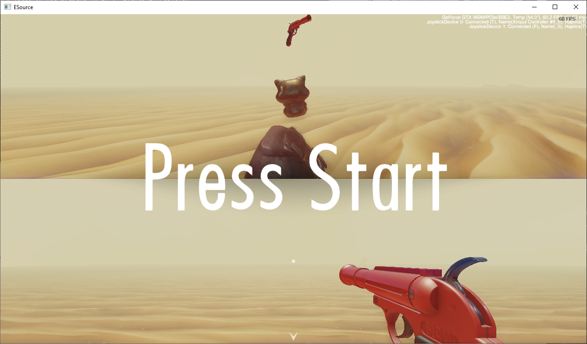
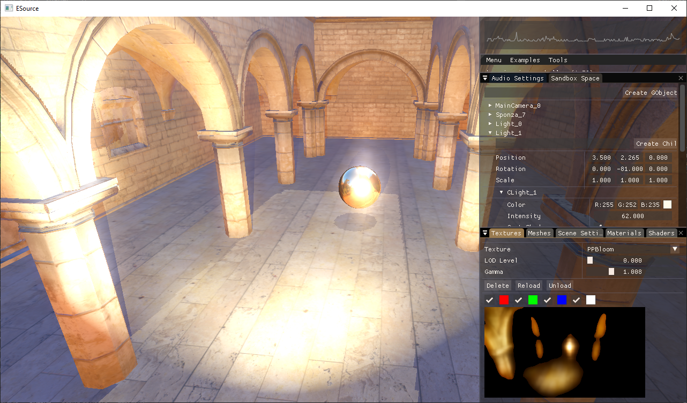

# EmptySource
## A game engine specialized in 3D and events systems

The objective of this project is learn: graphics, software arquitecture, events, math and 3D animation.
It was part of my university final project.

## Using
- C++ ***Language***
- OpenGL ***Graphics API***
- GLAD ***OpenGL Function Loader***
- SDL2 ***Input, Windows***
- STB_Image ***Load Images***
- FreeType2 ***Text Rendering***
- NVML ***Device info***
- Assimp ***Model loader***
- TSL Map ***Replace of std::map***

I was able to make a FPS game: A prop hunter game with local multiplayer, where you need to shoot the prop to win.

